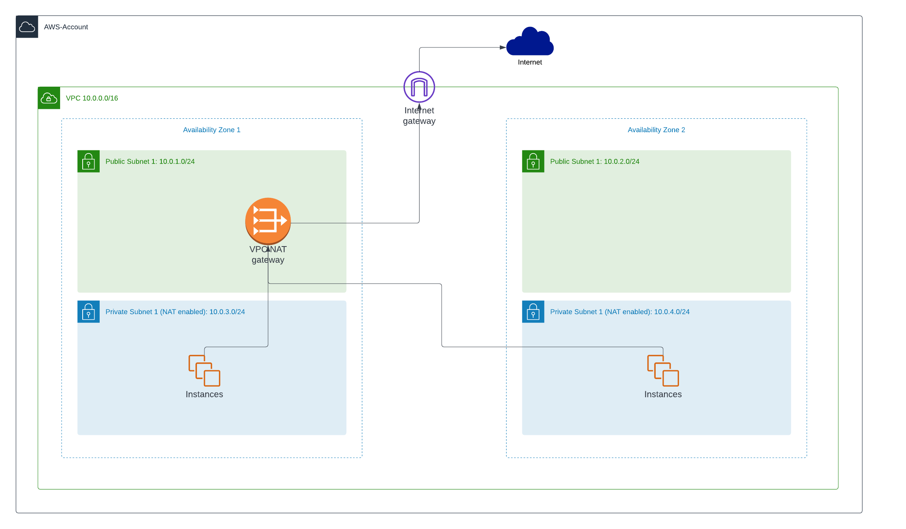

# General

This is a fully working example for a AWS-Region. You only need to modify it to your needs.

# Why NAT-Instance instead of a NAT-Gateway?

AWS offers since several years a NAT-Gateway which is fully managed by AWS. The NAT-Gateway is a great way to enable NAT-Access for your private networks. 
But this convenience comes with higher costs. Just to run a NAT-Gateway you have costs more then $30 each month.. Additionally there are costs for traffic which is not to ignore.

A much cheaper solution for this is to maintain a NAT-Instance. If you use a t3.nano for example you have really low costs compared to the NAT-Gateway.

The disadvantage in this case is: You are responsible to maintain your NAT-Instance and keep it running.

A full compare from AWS can be found here: 
https://docs.aws.amazon.com/en_us/vpc/latest/userguide/vpc-nat-comparison.html

The NAT-Instance could me very helpful in staging or developming environments to reduce costs. In productions environments a NAT-Gateway could be the better choice.

# VPC Overview

This is a overview of the example VPC including a NAT-Instance we will create with this example. 

